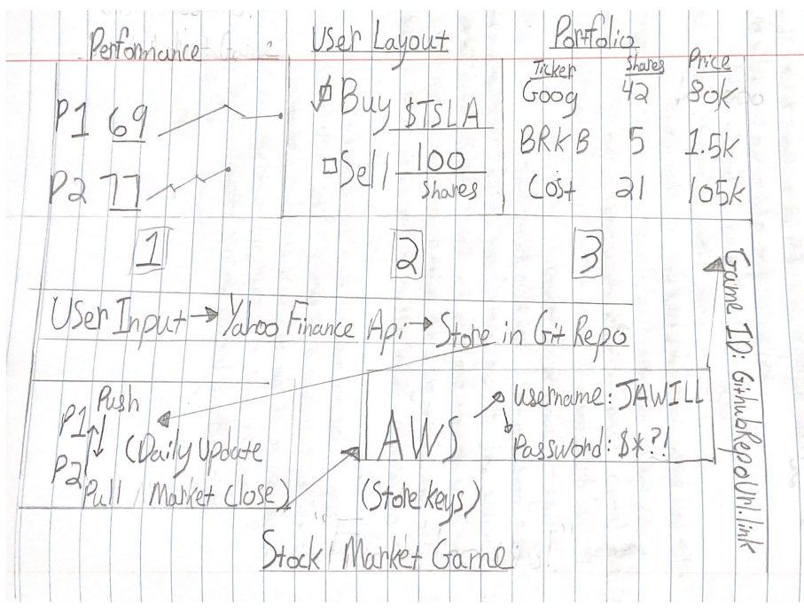

# Startup
CS 260
I am making changesI am making changesI am making my final change
Evil Merge Conflict
Test little thingIntially I stuggled with some editing issues trying to freehand everything and I somhow broke my repository. Istead of figuring out how to fix it, I made a new one.
I'm trying to figure out page break

I think I finally figure out page break

Elevator Pitch: Imagine a world of trading without the hassle of using your own money. Battle against your friends in a 1 on 1 simulation to see who can generate the most alpha. RAFT will utilize the Yahoo Finance API and and Websockets to communicate and compare performance metrics peer to peer. The game will be barebones in design, featuring a buy and sell button and trader's gut instinct. Do you think you have what it takes to come out on top?

http://3.15.54.213
ssh -i ~/CS260/1220.pem ubuntu@3.15.54.213
That's it, I have officially created a website. Initially, I couldn't figured out how to get into my website. It said [blank] sent an invalid response. After, consulting discord, I found someone else experiencing the same "Issue was I was typing in https://, it wasn't working, but when I do http:// it does work."
https://startup260.click
I am driving my own website name! It took a while for my website request to stop pending. The proccess of tying my website name to my ip address was easy. 
I have updated my website to https instead of http so now it is secured. The proccess is neat becuase of how simple it is to make a secured website. I forgot to hit escape when after I was in editing mode in git bash and left and made a merge conflict unintentionally. I restarted the cornel and deleted the change and tried again.
2/6/2023: Now I am updating the HTML structure and my favorite part are the hpyerlinks becuase it seems like majic. It is cool being able to edit a website and seeing it change after you save. Like I did something. The format type of html is confusing. I am figuring things out by trial and error by deleting it and seeing what it does. I like all the boxes and borders but don't really get the intention or integration. I've been busy breaking your code in html and experimenting with boxes. I have so say it's hard to break the code and do stuff to it than I anticipated. It is completely unlike Python or C++ and more like an instruction manual instead of step by step directions.
2/7: I've decided to timestamp the things I do. That way It'll be better indexed. Today I changed my website through the github repo proffessor Jensen made for me. I was struggling until I realized I had to gitclone the url into my projectfile to access eployWebsite.sh, but after that, it was suprisingly smooth sailing.
2/8: It's been an enthralling expreience pushing the website up and having a subset of it created in the simon directory. I am enjoying the proccess of git cloning my directory and then going in and git pull and doing $ ./deployFiles.sh -k ~/CS260/1220.pem -h startup260.click -s simon to update my website online.
2/6 (Late?) I think the coolest part of the website image is you're tying a piece that you don't really own and just linking it to display on your website. This is opposed to uploading a photo to GitHub where it is stored. It's on the web, you're just conveniently retrieving it. 
(2/12) This assignment impressed me with the durability of Code pen. This resource rendered my website fast, allowing for Realtime iteration. I found out that you use selectors to modify different parts of the html. The two codes, html and css, are durable and mesh well.  
(2/15) I learned how to use an iteractive button to complete commands. For example, mine changed the image from a blue whale to a basking shark. I learned to use Media queries to rotate the whale facing down so she was in view while in portrait mode. This assignnment pushed me to figure out how devolopers make website mobile compatible. 
(2/17) I worked on the bootstrapping part of the web design sequence. It was loads of fun messing with clicky buttons that did absouletely nothing. I learned that the boostraps were coded in HTML and the CSS was seemingly outsourced. I also experimeneted with deleting random chunks of code to see what stayed and what didn't.
(2/20) Things are falling nicely together building my website. I am implementing multistage features that I learned throughut tuturials in previous sections. My knowledge is buidling. The interplay between different kinds of code editors is something to marvel at such as gitbash, github, vscode. It's like a pattern.
(2/21) I dove into the Javascript loops and coniditionals. Coming from CS 111, the syntnax is more intensive, for example, how you can declare variables and how operators can overide eachother. The multifacetebillity of codepen never ceases to amaze me, and I'm exctited to learn why to never bet against JavaScript.
(2/22) Startup: https://startup.startup260.click/ (Redundant) I'll begin with the basics and make a utilitarian website. For future reference, I plan to store user data and enable them to play a game. 
(2/23) Today I made big moves updating my startup. I implimented the cosmestics of the thing and eventually, I'll do the guts. I plan on storing username and password, have a stock chart that updates daily (Excel Spreadsheat) and clicky buttons that clear when depressed. 
(2/24) I learned more about JavaScript than in my entire life. Some features are cool like functions and arrays, while others are lame like arrows and pointers. It is hard to visualize what certain elements do. I think it's cool to have functioning code in your code besides the cosmetic html and css, but I want to port tools.
(2/27) JavaScript is strange in the fact that when I didn't know if it was functioning. My fault probably lied within that I wasn't logging the output of my regex so it wasn't displaying in the console window. Rest and Spread both use three dots, but  rest adds other info supplied by the user to the array. While spread expands interables into individual elements. Destructuring is cool, you can feed an entire array into the code and by placing variables in sequential array order, can harvest values from it. It seems like indexing, like [1:] done in python. Exceptions are cool. They are anti website crashers to siphone code that doesn't work Though, I'm surprised with how resiliant most code is and will run "relatively" alright even with bugs.
(2/28) I like DOM because allows you to hide elements and manipulate HTML. This will be useful in my startup when I want to use interactive buttons. 
(3/1) Promises in JS are weird, factually, the examples exhibit them in random probabillity events. The three values of pending, fulfilled, and rejected represent the reserved state of the promise. Async/await syntax resolves the verbose promise within a promise and is interpreter sugar. It makes things wait so that everything outputes at the same time. The rule for using await is a top level module function or called from an async function.
(3/2) The interactivity of Javascript never ceases to blow me away. The abillity to save a user's entry into the website then updates the scorebaord too is pretty cool. I need to be implimenting these technology into my startup as I learn them. I love how they mesh to form a cohesive whole that seems to work just right. 
(3/10) This is awfully emberassing, but I haven't updated my github in the longest time. As of now, I'm working on my Javascript Startup deliverable. I learned how to make a name stick into the webpage and also a some user input on the button click, now I need to learn how to call the javascript into the actual page itself in a graph and call the code in index.js. The idea behind this is making an await and an promise fufillment center in stock buys to make the process rockier than it should.
<li><strong>Jan 04, 2023</strong> - 109.11	114.59	107.52	113.64	113.64	180,389,000</li>
    <li><strong>Jan 05, 2023</strong> - 110.51	111.75	107.16	110.34	110.34	157,986,300</li>
    <li><strong>Jan 06, 2023</strong> - 103.00	114.39	101.81	113.06	113.06	220,575,900</li>
    <li><strong>Jan 09, 2023</strong> - 118.96	123.52	117.11	119.77	119.77	190,284,000</li>
    <li><strong>Jan 10, 2023</strong> - 121.07	122.76	114.92	118.85	118.85	167,642,500</li>
    <li><strong>Jan 11, 2023</strong> - 122.09	125.95	120.51	123.22	123.22	183,810,800</li>
    <li><strong>Jan 12, 2023</strong> - 122.56	124.13	117.00	123.56	123.56	169,400,900</li>
    <li><strong>Jan 13, 2023</strong> - 116.55	122.63	115.60	122.40	122.40	180,439,300</li>
    <li><strong>Jan 17, 2023</strong> - 125.70	131.70	125.02	131.49	131.49	186,477,000</li>
    <li><strong>Jan 18, 2023</strong> - 136.56	136.68	127.01	128.78	128.78	195,680,300</li>
    <li><strong>Jan 20, 2023</strong> - 128.68	133.51	127.35	133.42	133.42	138,429,900</li>
    <li><strong>Jan 23, 2023</strong> - 135.87	145.38	134.27	143.75	143.75	203,119,200</li>
    <li><strong>Jan 24, 2023</strong> - 143.00	146.50	141.10	143.89	143.89	158,699,100</li>
    <li><strong>Jan 25, 2023</strong> - 141.91	146.41	138.07	144.43	144.43	192,734,300</li>
    <li><strong>Jan 26, 2023</strong> - 159.97	161.42	154.76	160.27	160.27	234,815,100</li>
    <li><strong>Jan 27, 2023</strong> - 162.43	180.68	161.17	177.90	177.90	305,632,100</li>
    <li><strong>Jan 30, 2023</strong> - 178.05	179.77	166.50	166.66	166.66	230,878,800</li>
    <li><strong>Jan 31, 2023</strong> - 164.57	174.30	162.78	173.22	173.22	196,813,500</li>
(3/12) The world of fetch, node.js, npm, and API makes my head whirl. After I understand this world, I'm for the ability find get a stock quote given a ticker smybol. Upon searching NPM, I've found something, but I'm getting a 0 crum error. (https://www.npmjs.com/package/yahoo-finance).
